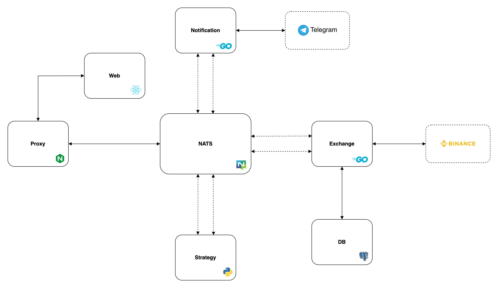
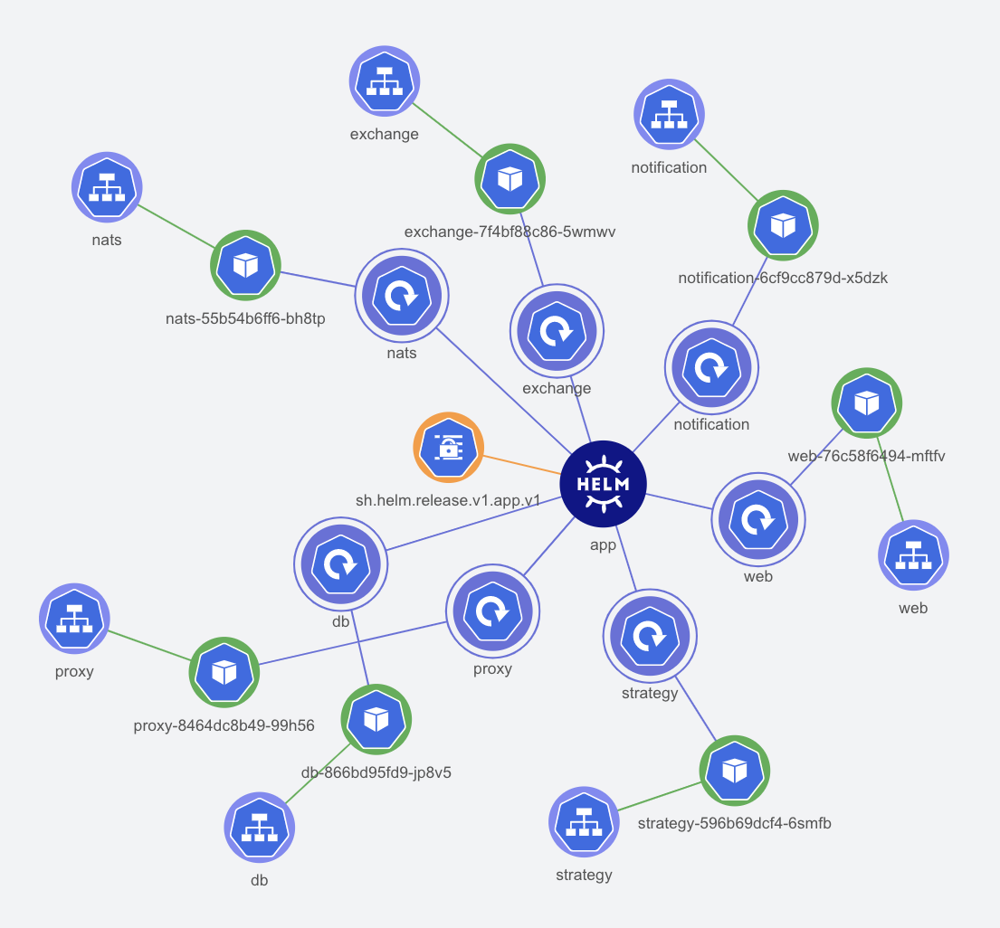

## Trader (yet to be named properly!)

<br />


<!-- TODO_CODE_QUALITY -->
#
<br />

<p align="center">
<a href="https://www.buymeacoffee.com/karanps" target="_blank"></a>


_**USE THIS SOFTWARE AT YOUR OWN RISK. THE AUTHORS AND ALL AFFILIATES ASSUME NO LIABILITY FOR YOUR TRADING OUTCOMES.**_

TODO Screen shots

## 📖 Contents

- [Architecture](#architecture)
- [Getting Started](#getting-started)
- [Deployment](#deployment)
- [Usage](#usage)
- [License](#license)

## <a id="architecture" style="color: black;">Architecture</a>

<!-- 

 -->


_Note: The k8s diagram was generated using [Lens - The Kubernetes IDE](https://github.com/nevalla/lens-resource-map-extension/)_

## <a id="getting-started" style="color: black;">Getting Started</a>

**Tools**

-  [Minikube](https://minikube.sigs.k8s.io/docs/start/)
-  [Skaffold](https://skaffold.dev/docs/install/)
-  [Helm](https://helm.sh/docs/intro/install/)
-  [Go >= 1.17](https://go.dev/doc/install)
-  [Node >= 16.13](https://nodejs.org/en/download/)
-  [Python >= 3.8](https://www.python.org/downloads/)
-  [yq](https://github.com/mikefarah/yq)
-  [volta](https://volta.sh/)
-  [doctl](https://github.com/digitalocean/doctl)

**Steps**

- Once all the tools are installed, execute `make prepare` to prepare local environment.
- Create a `infrastructure/k8s/env.yaml` file and add your secrets as shown in `infrastructure/k8s/env.example.yaml`.
- Review the configuration in `services/exchange/config.json`
- Start development with `make dev` command.
- Use `make stop` to stop the local minikube cluster.

## <a id="deployment" style="color: black;">Deployment</a>

Deployments are done automatically via `deploy.yml` github actions on merge with `main` branch. It supports manual deployment as well. But first we will need to provision our infrastructure.

_Note: Infrastructure we're about to provision has it's own cost!_

**Tools**

- [Terraform](https://learn.hashicorp.com/tutorials/terraform/install-cli)

**Steps**

- Get an API token from DigitalOcean [dashboard](https://cloud.digitalocean.com/account/api/tokens).

- Export it temporarily for terraform.

```
$ export DIGITALOCEAN_TOKEN=value-of-your-token
```

- Apply terraform configuration.

```
$ cd infrastructure
$ terraform init
$ terraform apply
```

- Go to Github and add `DIGITALOCEAN_TOKEN` to your repository secrets for github actions.
- Generate `base64` string of your secrets, and add it as `APP_SECRETS` to your repository secrets for github actions. 

```
$ cat infrastructure/k8s/env.yaml | base64
```

- Go to the actions tab and run `Build and Deploy` action.

_Note: If you want to change name of the project, make sure to update all the associated kubernetes manifest files, skaffold config etc._

## <a id="usage" style="color: black;">Usage</a>

Since this application deals with sensitive personal financial data, it is **not recommended** to expose it via ingress unless we have proper authorization in place. Hence, it is recommended to connect to it via port-forwarding on your local machine.

**Steps**

- Connect to the application via port-forwarding using `make connect` command.

_Note: Make sure `doctl` is authenticated, and we're using correct k8s cluster name._

- Open `localhost:8080` to see the web interface.

- Once done, use the `make disconnect` command to remove the kubectl context from your machine.

_Note: It is recommended to use the telegram bot over user interface on non-secure systems._

## 📄 <a id="license" style="color: black;">License</a>

This project is GPL-3.0 licensed, as found in the [LICENSE](/LICENSE)
