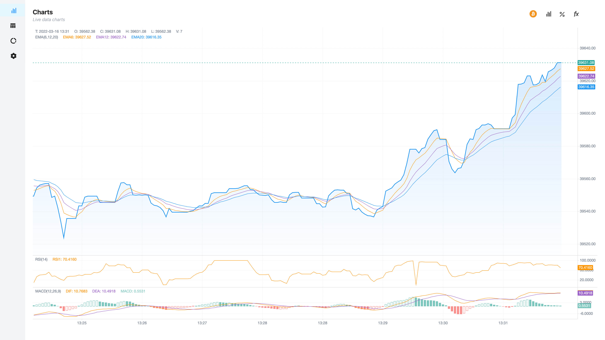
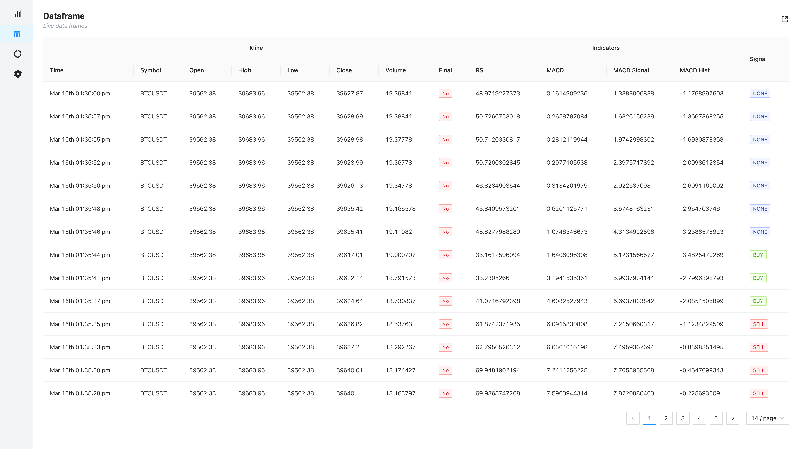
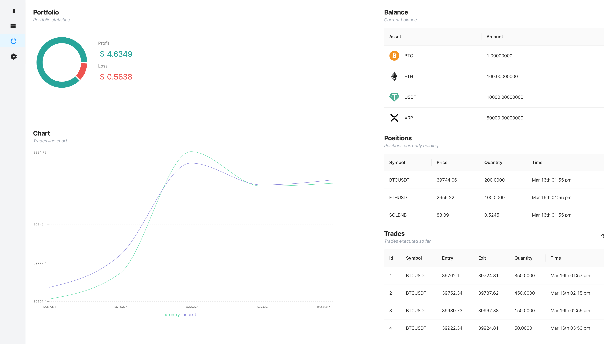
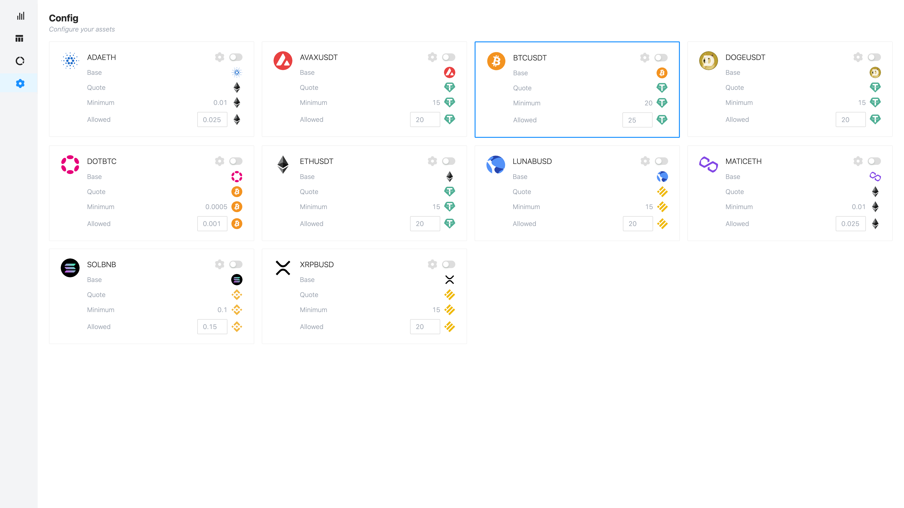
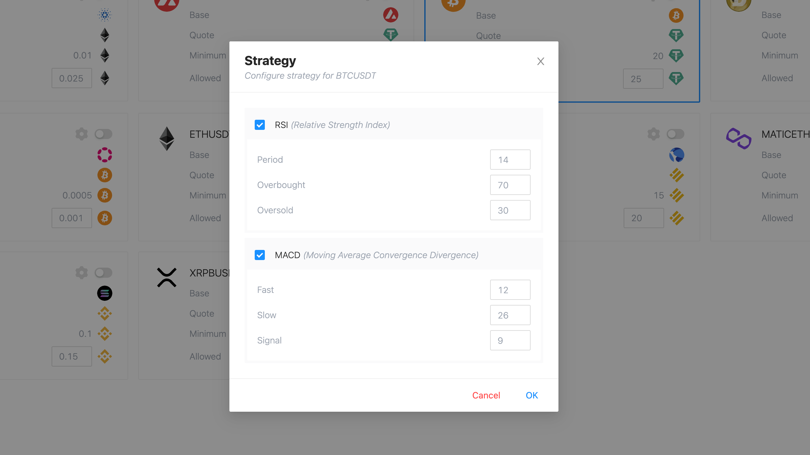
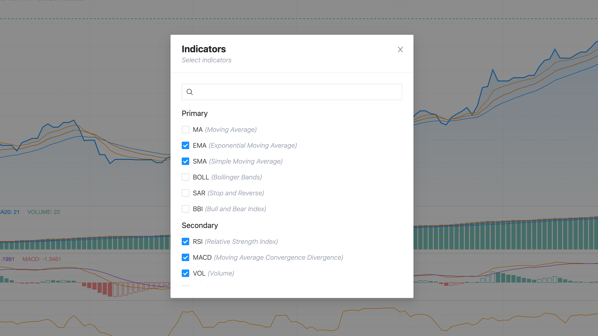
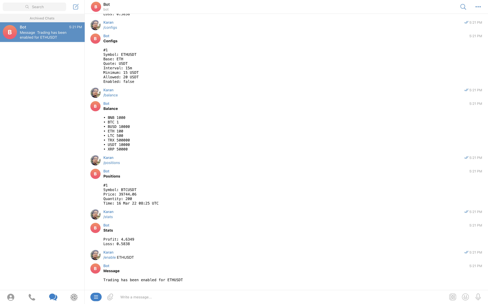
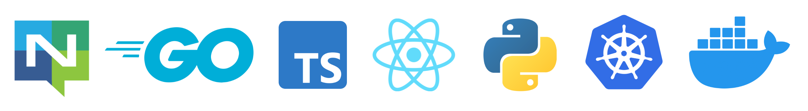
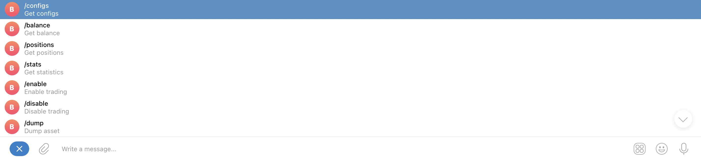

## Trader (yet to be named properly!)

<br />

<!--
TODO:
- Name?
- Badge
  - Build status
  - Code Quality
- Article
-->

_**USE THIS SOFTWARE AT YOUR OWN RISK. THE AUTHORS AND ALL AFFILIATES ASSUME NO LIABILITY FOR YOUR TRADING OUTCOMES.**_

<br />

<p align="center">
<a href="https://www.buymeacoffee.com/karanps" target="_blank"></a>


 
 
  

## 📖 Contents

- [Motivation](#motivation)
- [Features](#features)
- [Technologies](#technologies)
- [Architecture](#architecture)
- [Getting Started](#getting-started)
- [Deployment](#deployment)
- [Usage](#usage)
  - [Telegram](#telegram)
  - [Web](#web)
- [Contribute](#contribute)
- [License](#license)

## 💡 Motivation <a id="motivation" />

Few months ago I got into crypto market. It was all new and facinating to me. Idea of this project originally came from a script I used to automate buying and selling of fiat assets.

I was curious and wanted to scale it into a real system which can execute trades for me. I had a lot of fun building this. I got to integrate lots of different technologies while growing my financial knowledge.

Feel free to [reach out](https://karanpratapsingh.com?action=contact) to me if you have any additional questions. There is lot's of fixes and features to be done!

**Please leave a ⭐ as motivation or support by [donating](https://www.buymeacoffee.com/karanps) if you liked the idea 😄**

## ✨ Features <a id="features" />

This system has lots of features such as:

- **Web UI**: Real-time access for charts, technical indicators, and portfolio.

- **Configurable**: Supports assets and strategies customization easily without touching any code!

- **Portable**: Export your trades and real-time dataframe to CSV.

- **Multiple Assets**: Trade multiple crypto assets simultaneously!

- **Telegram Support**: On the move? Use [Telegram](#telegram) bot to recieve real-time notifications and much more.

- **Easy to upgrade**: Modify the system easily to your needs.

## ⚡️ Technologies <a id="technologies" />



## 🏭 Architecture <a id="architecture" />

It's a microservices based architecture with event driven approach for decoupling. It uses distributed streams and messaging which keeps the system simple yet robust to make sure it can grow in future.

 

_Note: Kubernetes diagram was generated using [Lens - The Kubernetes IDE](https://github.com/nevalla/lens-resource-map-extension/)_

**Why so many technologies?**

This started as an all Go project, but then I decieded to add Python to the mix as it has really good ecosystem for technical indicators and mathematical usecases.

For user interface I used React as it's easy and TypeScript provides some sanity to JavaScript projects!

Nginx and Postgres fit right in as the usecase grew. As always, use what's right for the project!

**Why event driven?**

Originally I made this using HTTP REST, but systems like this are event driven by nature. Plus this approach helps to decouple services even more.

**How do services communicate?**

All the messaging infrastructure use cases are handled by [NATS](https://nats.io). Service communication are mainly via publish-subscribe and request-reply pattern. Essentially, NATS acts as our service mesh!

We also use [JetStream](https://docs.nats.io/nats-concepts/jetstream) to for real-time, persisted data streams.

 

_Read more about [Distributed communication patterns with NATS](https://dev.to/karanpratapsingh/distributed-communication-patterns-with-nats-g17)_

**Why Kubernetes? Isn't it overkill?**

I agree! Kubernetes can be bit overkill, especially for this project. But my goal here was to keep it cloud agnostic, even though it was very tempting to just spin up AWS lamdas with event bridge.

## 🍕 Getting Started <a id="getting-started" />

**Tools**

- [Minikube](https://minikube.sigs.k8s.io/docs/start/)
- [Skaffold](https://skaffold.dev/docs/install/)
- [Helm](https://helm.sh/docs/intro/install/)
- [Go >= 1.17](https://go.dev/doc/install)
- [Node >= 16.13](https://nodejs.org/en/download/)
- [Python >= 3.8](https://www.python.org/downloads/)
- [yq](https://github.com/mikefarah/yq)
- [volta](https://volta.sh/)
- [doctl](https://github.com/digitalocean/doctl)

**Steps**

- Once all the tools are installed, execute `make prepare` to prepare the local environment.
- Create a `infrastructure/k8s/env.yaml` file and add your secrets as shown in `infrastructure/k8s/env.example.yaml`.
- Review the configuration in `services/exchange/config.json`
- Start development with `make dev` command.
- Use `make stop` to stop the local minikube cluster.

## 🚀 Deployment <a id="deployment" />

Deployments are done automatically via `deploy.yml` github actions to [Digital Ocean](https://www.digitalocean.com/) on merge with `main` branch. It supports manual deployment as well. But first we will need to provision our infrastructure.

_Important: Infrastructure we're about to provision has it's own cost!_

**Tools**

- [Terraform](https://learn.hashicorp.com/tutorials/terraform/install-cli)

**Steps**

- Get an API token from DigitalOcean [dashboard](https://cloud.digitalocean.com/account/api/tokens).

- Export it temporarily for terraform.

```
$ export DIGITALOCEAN_TOKEN=value-of-your-token
```

- Apply terraform configuration.

```
$ cd infrastructure
$ terraform init
$ terraform apply
```

- Go to Github and add `DIGITALOCEAN_TOKEN` to your repository secrets for github actions.
- Generate `base64` string of your secrets, and add it as `APP_SECRETS` to your repository secrets for github actions.

```
$ cat infrastructure/k8s/env.yaml | base64
```

- Go to the actions tab and run `Build and Deploy` action.

_Note: If you want to change name of the project, make sure to update all the associated kubernetes manifest files, skaffold config etc._

## 📚 Usage <a id="usage" />

### 💬 Telegram <a id="telegram" />

**Commands**



### 💻 Web <a id="web" />

Since this application deals with sensitive personal financial data, it is **not recommended** to expose it via ingress unless we have proper authorization in place. Hence, it is recommended to connect to it via port-forwarding on your local machine.

**Steps**

- Connect to the application via port-forwarding using `make connect` command.

_Note: Make sure `doctl` is authenticated, and we're using correct k8s cluster name._

- Open `localhost:8080` to see the web interface.

- Once done, use the `make disconnect` command to remove the kubectl context from your machine.

_Note: It is recommended to use the telegram bot over user interface on non-secure systems._

## 👏 Contribute <a id="contribute" />

Contributions are welcome as always, before submitting a new PR please make sure to open a new issue so community members can discuss.

Additionally you might find existing open issues which can helps with improvements.

This project follows standard [code of conduct](./CODE_OF_CONDUCT.md) so that you can understand what actions will and will not be tolerated.

## 📄 License <a id="license" />

This project is GPL-3.0 licensed, as found in the [LICENSE](./LICENSE)
