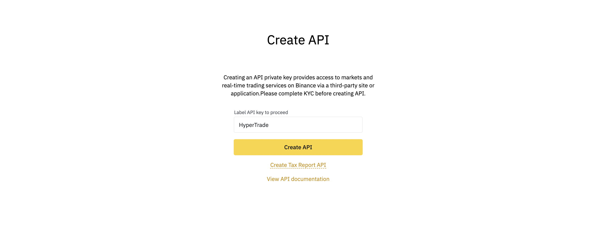
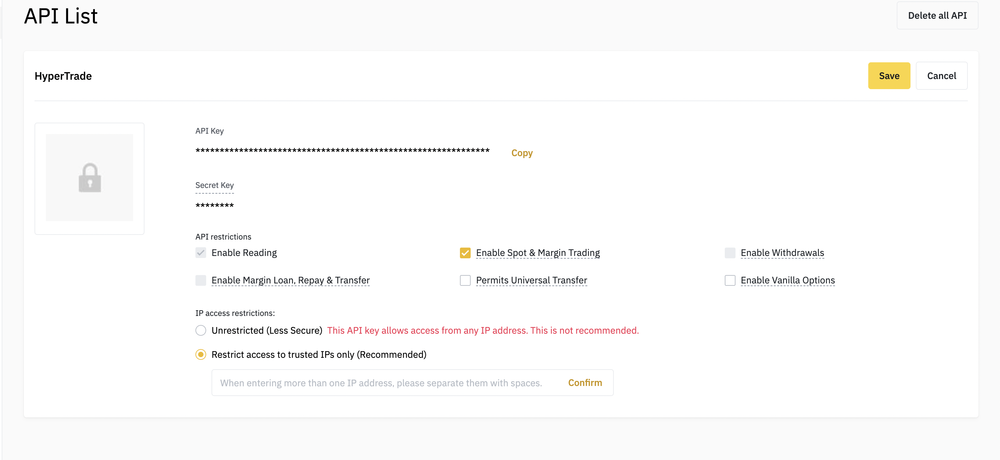
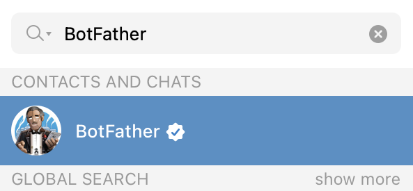
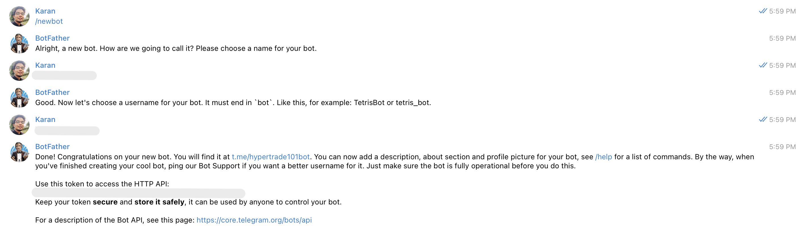
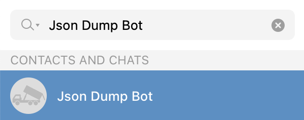
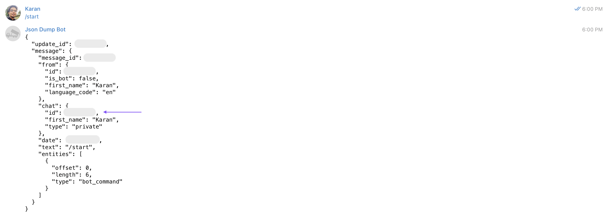

## Secrets setup

This document will help us with setting up essential secrets for HyperTrade.

### Binance

**Testnet**

This is recommended if you want to explore and play around.

- Head over to [Binance Testnet](https://testnet.binance.vision/) and login with Github.

- Click the `Generate HMAC_SHA256 Key` 

- Add a description and click the generate button

- Now we will be presented with `BINANCE_API_KEY` and `BINANCE_SECRET_KEY` secrets.

_Note: If you're using testnet, make sure to use `BINANCE_TESTNET` as `true`_

**Production**

This will help us run the app in production mode with data. Use this at your own risk. The author and contributors assume no liability for this.

- Simply go to binance [API management](https://www.binance.com/en/my/settings/api-management) and create a new key.

- Make sure to only allow spot & margin trading. It is recommended to also restrict access to trusted IPs.

- Now we can use these as our `BINANCE_API_KEY` and `BINANCE_SECRET_KEY` key.

### Telegram

This section will help us with setting up our telegram bot.

**API Token**

This token will be our `TELEGRAM_API_TOKEN`. For this, we need to use the following steps:

- Search for `@BotFather` bot on telegram

- Use the `/newbot` command and answer some questions to get your API token which

**Chat ID**

This is the chat ID our system will use to send out notifications.

- Simply use the `/start` command with `@JsonDumpBot`. Use the `chat.id` as `TELEGRAM_CHAT_ID`.

- Now, search for the bot you created and start the conversation.
